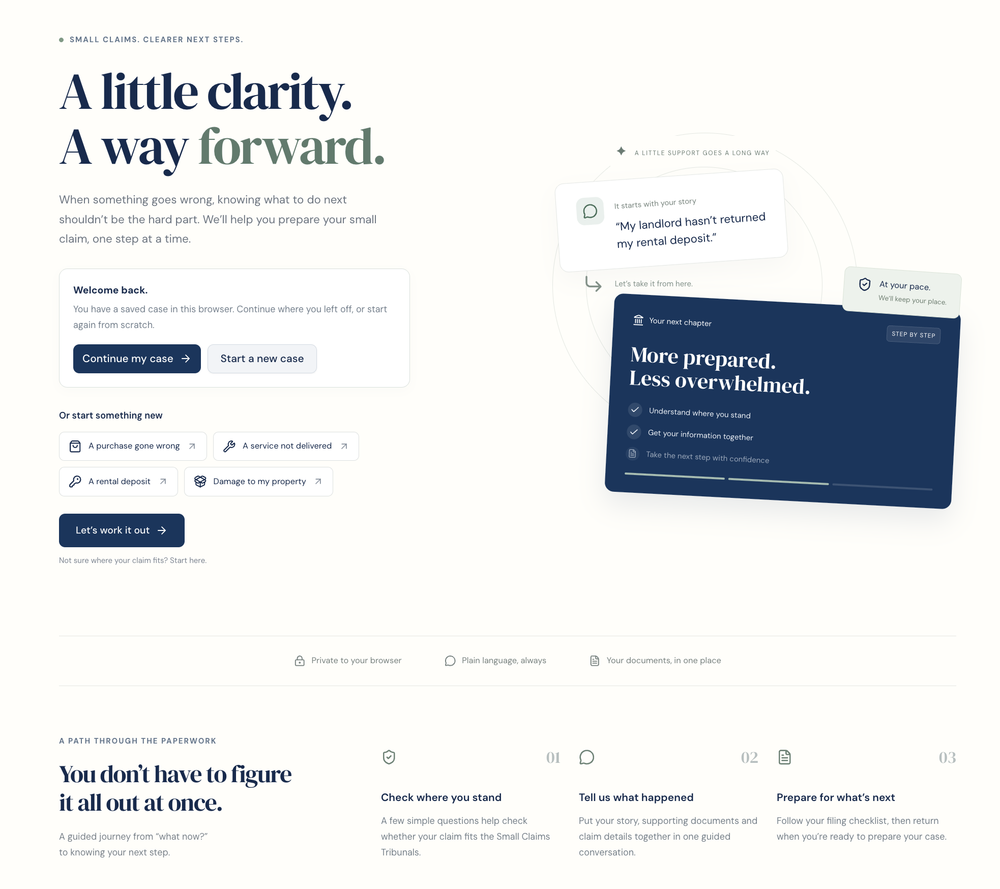
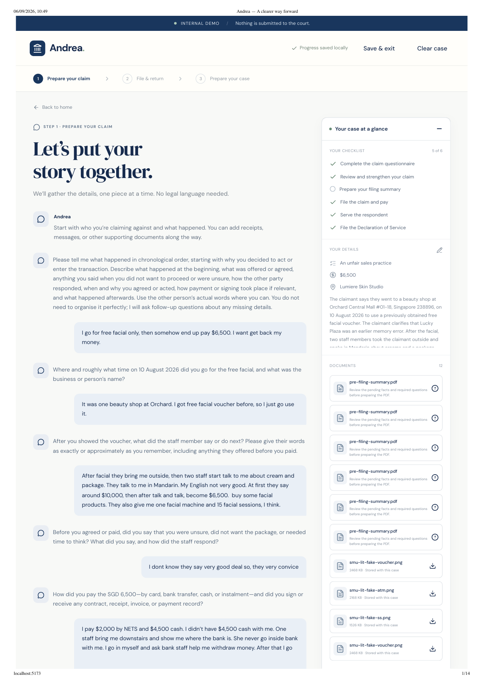
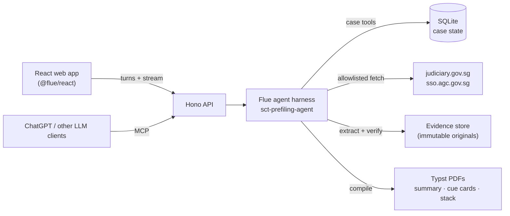

# Andrea · SMU LIT Legal-Tech Hackathon 2026

**Small claims. Clearer next steps.**

Andrea is an AI harness that helps self-represented persons (SRPs) prepare claims for Singapore's Small Claims Tribunals (SCT). It does not answer "Do I have a case?" from a few assumed facts. It walks the user through a structured process instead: what happened, whether the claim is eligible, which facts matter, what evidence supports them, and what the other side might say.

Built by Team Freedom for the SMU LIT Legal-Tech Hackathon 2026 · [Devpost](https://devpost.com/software/project-andrea) · [Pitch deck (PDF)](docs/Andrea-SCT-pitch.pdf)

## The problem

SRPs increasingly use GenAI to prepare SCT claims. General-purpose models can hallucinate, or simply agree with a user's framing instead of spotting missing information or testing their account. For someone already facing an unfamiliar and stressful process without a lawyer, that can mean a poorly prepared claim and more uncertainty.

Take Mdm Tan, an elderly Mandarin-speaking claimant. She walked into a salon expecting a $30 haircut and says she was pressured into a $100 package. Her story is simple: "I was badgered. I had no choice." Andrea's job is to turn that story into a properly prepared claim.

## How it works

Andrea guides the user through one flow, from first story to hearing day:

**Understand → Clarify → Identify → Test → Evidence → Organise**

1. **Prepare your claim.** A plain-language conversation gathers the story, checks eligibility and reads uploaded evidence (receipts, chat screenshots, bank slips).
2. **File and return.** A pre-filing summary PDF and a checklist for filing, serving the respondent and the Declaration of Service.
3. **Prepare your case.** A court-day pack: printable cue cards covering the timeline, key points and the outcome sought, plus one PDF stack with every piece of evidence.

### Guarding principles: G · P · T

- **Grounded.** Relies on authoritative sources (Singapore Statutes Online, eLitigation) and the user's own evidence.
- **Proportionate.** Tests every argument with three questions: what supports it, what's missing, and what might the other side say?
- **Transparent.** Separates *facts* (what the user says), *evidence* (what a document shows) and *possibilities* (what still needs checking). When the system doesn't know, it doesn't guess.

### From conclusions to facts

When a user says "I was pressured into buying this", Andrea neither agrees nor hands down a legal conclusion. It asks what they originally went there for, what price they expected, what they were told, and what exactly made them feel pressured. It then tests the other side: if the respondent says the user agreed voluntarily, which details close that gap? Where the evidence contradicts the account (a mismatched amount, an expired voucher), Andrea records it as unresolved instead of glossing over it.

The shift is from *"Tell AI my problem"* to *"Help me identify my relevant facts."*

**Sample outputs** from the fictional prefilled salon-package case:
[pre-filing summary](docs/samples/prefiling-summary.pdf) (4 pp) ·
[cue card](docs/samples/cue-card.pdf) (1 p) ·
[tribunal pack](docs/samples/tribunal-pack.pdf) (8 pp, with index and evidence)

Andrea doesn't decide who is right, guarantee an outcome or replace the SCT. It helps the user present their case clearly, objectively and confidently.

### Beyond the website

Not everyone will use Andrea's site, so the agent harness runs on its own. An opt-in MCP endpoint exposes it to ChatGPT and other LLM clients, which get the same guided workflow and verified PDFs. We also propose that SG Courts publish an `llms.txt`, so any assistant can find the official SCT guidance without being pointed at it.

## Running it

Setup, the prefilled demo walkthrough and the MCP endpoint are covered in [docs/setup.md](docs/setup.md).

## Repository layout

| Path | Contents |
| --- | --- |
| `frontend/` | React + Vite web app |
| `server/` | Hono/Flue backend, agent harness, MCP endpoint and Typst PDF generation |
| `slides/` | Slidev pitch deck |
| `docs/` | Backend contract, cue-card template, design decisions, user scenario |
| `demo/` | Demo evidence and (ignored) generated output |

## Under the hood

**The Flue harness.** The backend runs a single durable [Flue](https://www.npmjs.com/package/@flue/runtime) agent, `sct-prefiling-agent` ([server/src/agents](server/src/agents)). It runs an interview protocol that turns a user's account into labelled facts, using follow-up questions to fill gaps. Flue handles streaming, retries, durable conversation history and context compaction. The model is reached through OpenRouter. A scripted mock provider lets the whole flow run offline.

**The model never holds the case.** SQLite is the source of truth, and the agent can only change it through about 25 typed tools ([tools.ts](server/src/agents/tools.ts)), such as `propose_fact`, `verify_fact_against_files`, `add_contradiction`, `add_open_question` and `retrieve_official_guidance`. That is how the G·P·T principles are enforced:

- A user's claim, what a document shows, what the AI inferred and what the user reviewed are tracked separately. AI inferences stay pending until the user confirms them.
- Facts are checked against uploaded files by filename and page, message or image location. When sources conflict, the agent records a contradiction and asks the user instead of picking one.
- Procedural answers come only from an allowlist of official sources. If retrieval fails, the result is marked `UNVERIFIED`.
- Every edit is revisioned, and stale writes are rejected. Uploaded evidence is never overwritten, and uploaded content is treated as evidence, never as instructions to the agent.

**Documents are generated, not written.** The pre-filing summary, cue cards and tribunal stack are Typst PDFs compiled by harness tools from a snapshot tied to the current revision. The stack combines an index, the cue cards, the summary and every piece of evidence, with images, text and Office files converted to A4 pages. The agent can't claim a file exists unless the tool call that made it succeeded.

**MCP.** The same harness is exposed as a single conversational `talk_to_claim_guide` MCP tool ([server/src/mcp](server/src/mcp)). ChatGPT and other clients get the same guided interview and the verified final PDF.

**Stack:** React + Vite + Tailwind (frontend) · Hono + Flue + SQLite + Typst on Node 22 (backend) · Slidev (deck).

## Team Freedom

- [Keith Chew](https://www.linkedin.com/in/keithchew16/)
- [Man Ning Teo](https://www.linkedin.com/in/man-ning-teo-0391b22b5/)
- [Nitish](https://www.linkedin.com/in/tnitish654/)
- [Randall Yap](https://www.linkedin.com/in/randall-yap-a255a9228/)
- [Yannaputt Tim](https://www.linkedin.com/in/yannaputt-tim/)

> Andrea is a hackathon prototype. It supports preparation only and is not legal advice or an official court service.
