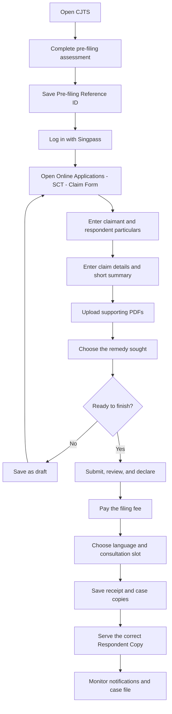

# CJTS normal-user filing flow

## Scope and source

This describes how an ordinary individual claimant files a small claim online in the supplied State Courts guide, *Filing a Small Claims in CJTS - A guide to filing small claims online*, dated April 2022.

It is a description of the guide's flow, not confirmation of the live CJTS process in 2026. Interface labels, fees, limits, and procedural requirements may have changed.

## Flow at a glance

## Normal claimant journey

### 1. Open CJTS

1. Go to <https://cjts.judiciary.gov.sg/>.
2. Select the **SCT** option under the online filing area.
3. Read the Terms and Conditions using the scroll bar.
4. Tick the agreement box.
5. Enter the CAPTCHA.
6. Select **Proceed**.

The guide warns the user not to use the browser's Back, Forward, or Refresh controls while submitting because this may disrupt the process. (Guide pp. 3-4)

### 2. Complete the pre-filing assessment

1. Select one main **Nature of Dispute**:
   - Contract for Sale of Goods;
   - Contract for Provision of Services;
   - Damage to Property; or
   - Lease Not Exceeding 2 Years (Residential Premises).
2. Expand the chosen category and select the appropriate dispute sub-category.
3. Enter the **Date of Cause of Action**.
4. Enter the **Claim Amount** in SGD.
5. Answer the Yes/No questions displayed by CJTS.

The questions change according to the selected dispute and earlier answers. They generally concern:

- who the parties are;
- whether the correct party is being claimed against;
- the agreement and nature of the dispute;
- whether supporting evidence exists;
- whether the opposing party is in Singapore; and
- whether the claimant can locate and serve the opposing party.

CJTS checks the entered date and amount and may warn that the claim is time-barred or outside the SCT's monetary jurisdiction. The guide does not state the applicable threshold. The form can be submitted when its completion status reaches 100%. (Guide pp. 5-7)

### 3. Save the Pre-filing Reference ID

After submission, CJTS displays an acknowledgement with a **Pre-filing Reference ID**.

The user should record this ID immediately because, according to the guide:

- it is required to start the claim form;
- it is not shown on the CJTS Home page; and
- it is valid for seven days.

The user then selects **Proceed to eFiling**. If the ID is not used within seven days, the pre-filing assessment must be completed again. (Guide p. 8)

### 4. Log in

For a normal individual filing in a personal capacity, the user logs in with **Singpass**.

Other guide branches are:

- **Corppass** for a corporate entity, sole proprietor, association, or society; and
- **CJTS Pass** for a person who is not eligible for Singpass.

(Guide p. 9)

### 5. Open the Claim Form

After login:

1. Open **Online Applications** from the left navigation panel.
2. Select **SCT**.
3. Select **Claim Form**.
4. Enter the Pre-filing Reference ID.
5. Select **Retrieve**.

The claim form contains six sections:

1. Particulars of Claimant(s)
2. Particulars of Respondent(s)
3. Particulars of Claim
4. Brief Summary of Claim
5. Supporting Documents
6. Type of Claim / Claiming For

The guide estimates that the form takes approximately 15 minutes to complete. (Guide p. 24)

### 6. Check the claimant's particulars

CJTS retrieves the claimant's details from the user's profile and pre-filing information. The user reviews and can amend them before submission.

The screen shown in the guide includes:

- full name;
- identification type and number;
- primary and optional secondary contact numbers;
- valid email address; and
- registered or service address.

The user can add another claimant or another service address if required. The guide says the Tribunals may use Contact No. 1 and the email address for communication. (Guide p. 25)

### 7. Enter the respondent's particulars

The user enters the opposing party's exact name and service details.

The screen shown in the guide includes:

- name or registered entity name;
- identification type and number, if known;
- contact numbers, if known;
- email address, if known; and
- registered or service address.

The user can add another respondent or another service address.

Every live-form field marked with an asterisk is mandatory. The guide also warns that an additional claimant, respondent, or address cannot subsequently be removed after the claim is submitted. (Guide pp. 25-26)

### 8. Enter the claim details

CJTS retrieves the **Nature of Dispute** and **Type of Dispute** from pre-filing.

The user then:

1. enters the name or type of goods sold or services provided, where requested;
2. completes the fields generated for that particular dispute type; and
3. supplies as much relevant factual information as possible.

The guide does not show one universal set of claim-detail fields. Its worked example is a residential rental-deposit claim, which asks for the rental-premises location, deposit paid, monthly rent, agreement date, tenancy start date, and tenancy expiry date. Those fields are example-specific. (Guide p. 26)

### 9. Enter the brief summary

The user enters a **Brief Summary of Claim** of no more than **500 characters**.

A practical summary normally states:

1. what the parties agreed;
2. what happened;
3. when it happened;
4. what remains unresolved; and
5. what order the claimant wants.

The five-part structure above is a drafting aid; the 500-character limit comes from the guide. (Guide p. 27)

### 10. Upload supporting documents

For each document, the user:

1. chooses the PDF file;
2. selects the document type;
3. enters a short description;
4. enters the relevant page number; and
5. selects the upload icon.

The guide's upload rules are:

- PDF format only;
- maximum 5 MB per document;
- no special characters in filenames; and
- a submitted document cannot later be deleted or removed from CJTS.

CJTS suggests document types according to the dispute. If either party is not an individual, the guide requires the latest ACRA Business Profile for that party.

The claim-form instructions also state that the respondent will be able to see all entered details and uploaded documents except the identification number. The user should therefore check that uploads do not contain unrelated sensitive material. (Guide pp. 24 and 27)

### 11. Select what the claimant is asking for

The user can select more than one remedy:

- **Money Order** - enter the value claimed in SGD.
- **Work Order** - describe the work to be performed and enter the substitute or alternative monetary value.
- **Costs** - request costs and provide supporting evidence.
- **Disbursements** - request disbursements and provide supporting evidence.

More than one work order can be added. The guide says costs and disbursements are awarded at the Tribunals' discretion. (Guide pp. 27-28)

### 12. Save a draft or submit

The user chooses one of two paths.

#### Save As Draft

- CJTS issues a draft number.
- The draft appears on the Home page.
- The guide says it remains available for seven days.
- Saving a draft does not mean that the Tribunals have received the claim.

#### Submit

- CJTS validates the form.
- Invalid fields are highlighted with a red border and an explanation.
- If there are no errors, CJTS displays the confirmation page.

(Guide p. 28)

### 13. Review and make the declaration

On the confirmation page, the user:

1. reviews all entered information;
2. selects **Amend** if corrections are needed;
3. ticks the declaration that the user is the claimant and that the information is true and correct; and
4. selects **Confirm to Proceed**.

(Guide pp. 29-30)

### 14. Pay the filing fee

The guide shows three payment choices:

- Internet Banking;
- Credit Card; or
- Pay Later.

After successful online payment, the user saves the payment receipt and selects **Continue**.

If **Pay Later** is chosen, CJTS generates a Payment Advice and stores the claim as a payment-pending draft. The guide says this draft is retained for three days. The user returns through the **Payment Pending** link to finish payment. (Guide pp. 31 and 34)

The guide says a claim is considered filed only when payment has been made and a claim number has been issued. It also warns that fees are not refunded for an incorrect claim. (Guide pp. 24 and 28)

### 15. Choose language support and a consultation slot

The user states whether they understand and speak English.

If not, the user selects a language. The guide shows:

- Cantonese;
- Hokkien;
- Malay;
- Mandarin;
- Tamil;
- Teochew; or
- Others.

The Registry will try to arrange an interpreter. If **Others** is selected, the guide says the user must arrange a qualified interpreter, subject to Registry approval.

The user then chooses an available consultation date and time and selects **Next**. The screen shown in the guide warns that, unless otherwise directed, an unresolved case may be fixed for hearing on the consultation day or the following working day. (Guide pp. 31-32)

### 16. Save the acknowledgement and case copies

The acknowledgement page displays the assigned case number and first consultation date and time.

The user saves:

- the Payment Receipt;
- the Claimant Copy, containing the consultation notice and claim form; and
- the Respondent Copy, containing the consultation notice, claim details, barcode, and one-time reference number.

(Guide p. 33)

### 17. Serve the respondent

The claimant serves the correct **Respondent Copy** on every respondent.

The acknowledgement shown in the guide warns that the SCT may be unable to proceed if the claimant cannot serve the respondent. Where there is more than one respondent, each respondent has a unique one-time reference number and must receive the matching copy. The guide does not state a separate service deadline on these filing pages. (Guide p. 33)

### 18. Monitor the case

After filing, the claimant uses CJTS to monitor:

- notifications;
- active cases;
- the next court date;
- payment records and receipts;
- documents in the case file; and
- later applications or submissions, if required.

The normal initial filing flow is complete once payment is made, the claim number is issued, the consultation is scheduled, the copies are saved, and the Respondent Copy is served. (Guide pp. 16-20 and 33-36)

## Important branches

| Situation | What the guide says the user does |
|---|---|
| The user is not ready to submit | Save As Draft and return within seven days. |
| The user chooses Pay Later | Generate the Payment Advice and complete payment within the three-day payment-pending draft period stated in the guide. |
| There are multiple claimants or respondents | Add each party before submission; additional parties cannot later be removed from a submitted claim. |
| A party is a business entity | Upload the latest ACRA Business Profile for that party. |
| The user does not understand or speak English | Select a listed language; for "Others", arrange a qualified interpreter subject to approval. |
| The dispute spans multiple main categories | File the claims separately. |
| The respondent cannot be served | The acknowledgement warns that the SCT may be unable to proceed. |

## Source limitation

This file intentionally does not add current fee amounts, jurisdictional thresholds, limitation periods, or service deadlines because they are not stated in the relevant pages of the supplied guide. Verify the live CJTS interface and current official State Courts directions before relying on this flow for an actual filing.
